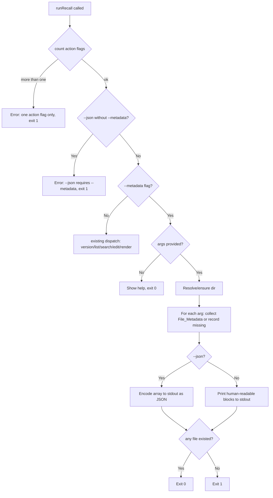

# Design Document

## Overview

This feature adds a `--metadata` (`-m`) action flag and a `--json` (`-j`) modifier
to the Recall CLI's root command. When `--metadata` is active with one or more
filename arguments, the CLI reports, for each existing Recall_File, its absolute
path, filesystem metadata (size, modification time, and — where the platform
exposes them — creation and inode-change times), and any tags parsed from the
file's front-matter. With `--json` set, the same information is emitted as a
JSON array instead of human-readable text.

`--metadata` joins the existing set of mutually-exclusive action flags
(`--edit`, `--search`, `--list`, `--init`, `--version`, `--completion`). `--json`
is a modifier that is only valid alongside `--metadata`, analogous to how
`--init-path` modifies `--init`. Both are registered as local (non-persistent)
flags so subcommands do not inherit them.

The core cross-platform challenge is that Go's `os.FileInfo` exposes only size
and modification time portably. Creation and change times live in the
platform-specific `syscall.Stat_t` behind `FileInfo.Sys()`, with different field
names and availability across macOS, Linux, and Windows. This is isolated behind
a small helper with per-OS build-tagged implementations.

## Architecture

The metadata flow follows the same shape as the existing action-flag handlers:

```
runRecall (-m) → runMetadata(args, jsonFlag)
                   → config.RecallDir() / EnsureDir()
                   → for each arg:
                        storage.Exists() → os.Stat() → platformTimes() 
                        storage.Read() → frontmatter.Parse() (tags)
                   → render text OR encode JSON
```



Note: the missing-file errors are written to stderr as they are encountered; the
exit code is decided after all arguments are processed (Requirements 3.3, 3.4).

## Components and Interfaces

### New: `cmd/metadata.go`

Houses the `--metadata` handler and the output rendering.

```go
// FileMetadata is the reported metadata for a single recall file. Time fields
// are pointers so that platform-unavailable times serialize as omitted rather
// than zero values.
type FileMetadata struct {
    Name       string     `json:"name"`
    Path       string     `json:"path"`
    SizeBytes  int64      `json:"size_bytes"`
    Modified   time.Time  `json:"modified"`
    Created    *time.Time `json:"created,omitempty"`
    Changed    *time.Time `json:"changed,omitempty"`
    Tags       []string   `json:"tags"`
}

// runMetadata reports metadata for each named file that exists in the recall
// directory. Missing files produce a stderr error but do not stop processing.
// Returns after writing all output; exits non-zero only if no file existed.
func runMetadata(names []string, asJSON bool) error {
    dir, err := config.RecallDir()
    if err != nil {
        fmt.Fprintln(os.Stderr, err)
        os.Exit(1)
    }
    if err := config.EnsureDir(dir); err != nil {
        fmt.Fprintln(os.Stderr, err)
        os.Exit(1)
    }

    var collected []FileMetadata
    for _, name := range names {
        if !storage.Exists(dir, name) {
            fmt.Fprintf(os.Stderr, "recall: file not found: %s\n", name)
            continue
        }
        md, err := collectMetadata(dir, name)
        if err != nil {
            fmt.Fprintf(os.Stderr, "recall: cannot read metadata for %s: %v\n", name, err)
            continue
        }
        collected = append(collected, md)
    }

    if asJSON {
        renderJSON(collected) // always emits a valid array, "[]" when empty
    } else {
        renderText(collected)
    }

    if len(collected) == 0 {
        os.Exit(1)
    }
    return nil
}
```

`collectMetadata` combines `os.Stat`, the platform time helper, and front-matter
tag parsing:

```go
func collectMetadata(dir, name string) (FileMetadata, error) {
    path := storage.FilePath(dir, name)
    abs, err := filepath.Abs(path)
    if err != nil {
        abs = path
    }
    info, err := os.Stat(path)
    if err != nil {
        return FileMetadata{}, err
    }
    created, changed := platformTimes(info) // *time.Time each, may be nil

    content, err := storage.Read(dir, name)
    if err != nil {
        return FileMetadata{}, err
    }
    tags, _ := frontmatter.Parse(content)
    if tags == nil {
        tags = []string{} // empty set, not null (Req 2.5, 4.2)
    }

    return FileMetadata{
        Name:      name,
        Path:      abs,
        SizeBytes: info.Size(),
        Modified:  info.ModTime(),
        Created:   created,
        Changed:   changed,
        Tags:      tags,
    }, nil
}
```

`renderJSON` uses `encoding/json` with indentation and RFC 3339 timestamps
(Go's `time.Time` marshals to RFC 3339 by default). It guarantees a non-nil
slice so an empty result encodes as `[]` (Req 4.5):

```go
func renderJSON(items []FileMetadata) {
    if items == nil {
        items = []FileMetadata{}
    }
    enc := json.NewEncoder(os.Stdout)
    enc.SetIndent("", "  ")
    _ = enc.Encode(items)
}
```

`renderText` prints a labeled block per file, omitting unavailable times:

```
Name:     docker
Path:     /Users/me/.recall/docker
Size:     1024 bytes
Modified: 2026-09-14T13:57:53-07:00
Created:  2026-09-01T08:00:00-07:00   (omitted if unavailable)
Changed:  2026-09-14T13:57:53-07:00   (omitted if unavailable)
Tags:     docker, devops, containers  (or "Tags:     (none)")
```

Multiple files are separated by a blank line.

### New: platform time helpers (`cmd/metadata_time_*.go`)

A per-OS helper resolves creation/change times from `os.FileInfo`. Signature is
shared; implementations are selected by build tags.

```go
// platformTimes returns creation and inode-change times when the platform
// exposes them; either may be nil.
func platformTimes(info os.FileInfo) (created, changed *time.Time)
```

- `cmd/metadata_time_darwin.go` (`//go:build darwin`): casts
  `info.Sys().(*syscall.Stat_t)`, using `Birthtimespec` for created and
  `Ctimespec` for changed.
- `cmd/metadata_time_linux.go` (`//go:build linux`): uses `Ctim` for changed;
  birth time is not portably available via `Stat_t`, so `created` is nil.
- `cmd/metadata_time_windows.go` (`//go:build windows`): casts
  `info.Sys().(*syscall.Win32FileAttributeData)`, using `CreationTime` for
  created; `changed` is nil (Windows has no inode-change time).
- `cmd/metadata_time_other.go` (`//go:build !darwin && !linux && !windows`):
  returns `nil, nil`.

Each guards the type assertion with the comma-ok form and returns nil on
failure, so a nil or unexpected `Sys()` never panics (Req 2.4).

### Modified: `cmd/root.go`

**New package-level variables:**

```go
metadataFlag bool // action flag
jsonFlag     bool // modifier
```

**In `init()`** — register as local flags:

```go
f.BoolVarP(&metadataFlag, "metadata", "m", false, "report file paths, metadata, and tags for the named files")
f.BoolVarP(&jsonFlag, "json", "j", false, "with --metadata, output the report as JSON")
```

**In `runRecall()`:**

1. Add `metadataFlag` to the action-flag count slice so it participates in the
   existing "only one action flag" enforcement (Req 5.1, 5.2).
2. After the `--init-path requires --init` check, add a symmetric guard:
   `if jsonFlag && !metadataFlag { error "--json requires --metadata"; exit 1 }`
   (Req 4.6).
3. Add a `case metadataFlag:` branch in the dispatch `switch`, before `default`:

```go
case metadataFlag:
    if len(args) == 0 {
        return cmd.Help()
    }
    return runMetadata(args, jsonFlag)
```

### Unchanged Components

| Component | Reason |
|-----------|--------|
| `internal/config` | Directory resolution/creation reused as-is |
| `internal/storage` | `Exists`, `Read`, `FilePath` reused as-is |
| `internal/frontmatter` | `Parse` reused for tag extraction |
| `internal/search`, `internal/renderer` | Unaffected |
| `cmd/edit.go`, `cmd/list.go`, `cmd/search.go`, `cmd/init.go`, `cmd/version.go`, `cmd/completion.go` | Unaffected; flags are local to root |

## Data Models

`FileMetadata` (defined above) is the single new model. It reuses:

- `int64` size and `time.Time` from `os.FileInfo`.
- `[]string` tags from `frontmatter.Parse`.

Pointer time fields (`*time.Time`) with `omitempty` provide the "omit when
unavailable" behavior for both JSON (Req 4.3) and, via nil checks, text output.

## Correctness Properties

*A property is a characteristic or behavior that should hold true across all valid executions of a system.*

### Property 1: Metadata reporting never mutates files

*For any* invocation of `recall -m <files...>` (with or without `-j`), the
contents, size, and modification time of every Recall_File shall be unchanged
after the command completes.

**Validates: Requirement 7.1**

### Property 2: Existing-file success dominates missing-file failure

*For any* argument list containing at least one existing file, the process exit
code shall be 0; *for any* argument list where every file is missing (and at
least one argument is given), the exit code shall be non-zero.

**Validates: Requirements 3.3, 3.4**

### Property 3: JSON output is always a valid array

*For any* argument list, `recall -m -j <files...>` shall write a single
well-formed JSON array to stdout — `[]` when no named file exists, otherwise one
object per existing file.

**Validates: Requirements 4.1, 4.2, 4.5**

### Property 4: Reported tags equal parser output

*For any* existing Recall_File, the tags reported (text or JSON) shall equal
`frontmatter.Parse(content)` on that file's bytes, with a null result
normalized to an empty set.

**Validates: Requirements 2.5, 4.2**

## Error Handling

| Condition | Behavior | Exit Code |
|-----------|----------|-----------|
| `--metadata` with no argument | Show help text | 0 |
| `--metadata` + another action flag | Print "only one action flag" error to stderr | 1 |
| `--json` without `--metadata` | Print "--json requires --metadata" to stderr | 1 |
| One arg, file exists | Print/encode metadata | 0 |
| Multiple args, some exist | Report existing; stderr error per missing | 0 |
| All args missing | stderr error per missing; `[]` if JSON | 1 |
| Recall directory unresolvable/uncreatable | Print error to stderr | 1 |
| `os.Stat`/read fails for an otherwise-present file | stderr error for that file; continue | 0 if others exist, else 1 |
| `--metadata`/`-m`/`--json`/`-j` on any subcommand | Cobra prints `unknown flag` / `unknown shorthand flag` to stderr | non-zero |

## Testing Strategy

### Unit tests (`cmd/metadata_test.go`)

- `platformTimes` with a real temp file: on the host OS, assert it does not
  panic and that returned pointers, when non-nil, are plausible (non-zero).
- `collectMetadata` on a temp file with a `tags:` first line: assert path, size,
  modtime, and tags; assert a tagless file yields an empty (non-nil) tag slice.
- `renderJSON` on an empty slice writes exactly `[]\n`; on a populated slice,
  round-trips back through `json.Unmarshal` into `[]FileMetadata`.

### Integration tests (subprocess-based, in `cmd/root_test.go`)

Following the existing pattern (`buildBinary`, `setupRecallDir`, run helpers):

| Test Case | Validates |
|-----------|-----------|
| `--metadata`/`-m` and `--json`/`-j` shown in `--help` | Req 1.5 |
| `-m docker` prints path, size, modtime, tags; exit 0 | Req 2.2–2.6 |
| `-m docker` on a tagless file reports empty tags | Req 2.5 |
| `-m -j docker` emits array of one object parseable as JSON with expected fields | Req 4.1, 4.2, 4.4 |
| `-m nope` (missing) → stderr error, exit 1 | Req 3.1, 3.3 |
| `-m docker nope` → docker reported, stderr error for nope, exit 0 | Req 3.2, 3.4 |
| `-m -j nope` → stdout `[]`, stderr error, exit 1 | Req 4.5, 3.3 |
| `-m` with no args → help, exit 0 | Req 3.5 |
| `-j docker` without `-m` → error, exit 1 | Req 4.6 |
| `-m -l` (two action flags) → error, exit 1 | Req 5.2 |
| `-m`/`-j` rejected on edit/list/search/init subcommands | Req 6.1, 6.2 |
| directory contents unchanged after `-m` run | Property 1 |
