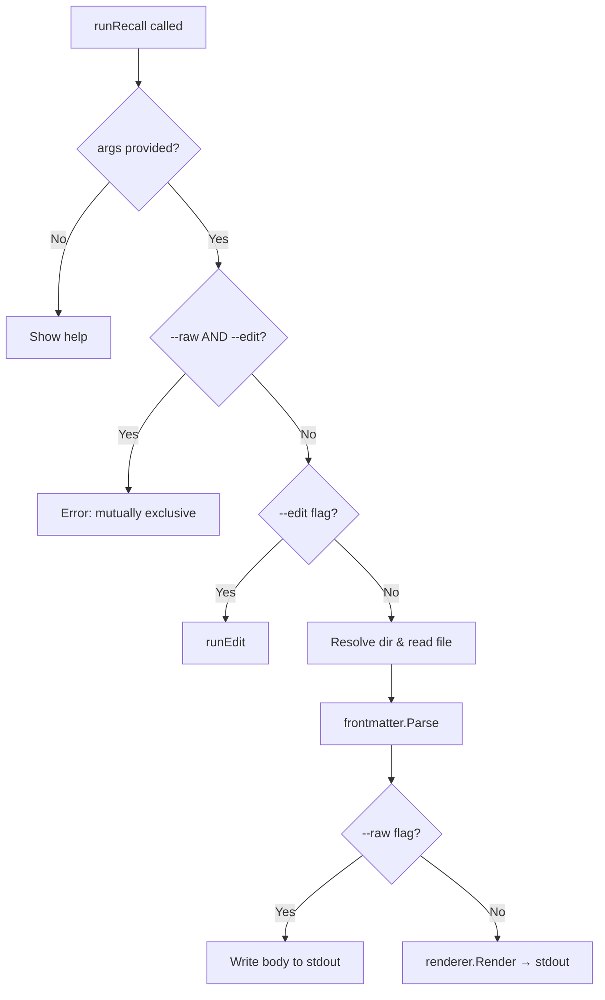

# Design Document

## Overview

This feature adds a `--raw` (`-r`) flag to the Recall CLI's root command that bypasses the Glamour markdown renderer and outputs plain markdown text directly to stdout. The change is confined to `cmd/root.go` and introduces no new dependencies or packages. When the flag is active, the existing front-matter stripping logic still runs, but the body is written to stdout verbatim rather than passed through `renderer.Render()`.

The flag is mutually exclusive with the existing `--edit` (`-e`) flag. It is registered as a local (non-persistent) flag so that subcommands do not inherit it.

## Architecture

The change is minimal and does not alter the overall architecture. The existing flow is:

```
runRecall → config.RecallDir() → storage.Read() → frontmatter.Parse() → renderer.Render() → stdout
```

With the `--raw` flag active, the flow becomes:

```
runRecall → config.RecallDir() → storage.Read() → frontmatter.Parse() → stdout (direct write)
```



## Components and Interfaces

### Modified: `cmd/root.go`

**New package-level variable:**

```go
var rawFlag bool
```

**Modified `init()` function:**

```go
func init() {
    rootCmd.Flags().BoolVarP(&editFlag, "edit", "e", false, "edit the specified file")
    rootCmd.Flags().BoolVarP(&rawFlag, "raw", "r", false, "output unformatted markdown without ANSI styling")
}
```

**Modified `runRecall()` function:**

The function gains an early mutual-exclusivity check and a conditional branch after `frontmatter.Parse`:

```go
func runRecall(cmd *cobra.Command, args []string) error {
    if len(args) == 0 {
        return cmd.Help()
    }

    filename := args[0]

    // Mutual exclusivity check
    if rawFlag && editFlag {
        fmt.Fprintln(os.Stderr, "recall: --raw and --edit flags cannot be used together")
        os.Exit(1)
    }

    // Delegate to edit if requested
    if editFlag {
        return runEdit(cmd, args)
    }

    // Resolve directory, check existence, read file (unchanged)
    dir, err := config.RecallDir()
    if err != nil {
        os.Exit(1)
    }
    if err := config.EnsureDir(dir); err != nil {
        os.Exit(1)
    }
    if !storage.Exists(dir, filename) {
        os.Exit(1)
    }
    content, err := storage.Read(dir, filename)
    if err != nil {
        os.Exit(1)
    }

    // Strip front-matter
    _, body := frontmatter.Parse(content)

    // Branch on raw flag
    if rawFlag {
        os.Stdout.Write(body)
        return nil
    }

    // Normal rendered path
    output, err := renderer.Render(body)
    if err != nil {
        os.Exit(1)
    }
    fmt.Print(output)
    return nil
}
```

### Unchanged Components

| Component | Reason |
|-----------|--------|
| `internal/frontmatter` | Already strips front-matter; used as-is by both paths |
| `internal/renderer` | Still used for the non-raw path; no changes needed |
| `internal/storage` | File read/exist logic is unchanged |
| `internal/config` | Directory resolution unchanged |
| `cmd/edit.go` | No flag registration changes needed |
| `cmd/list.go`, `cmd/search.go`, `cmd/init.go` | Unaffected; flag is local |

## Data Models

No new data models are introduced. The feature operates on the existing `[]byte` content returned by `storage.Read()` and the `[]byte` body returned by `frontmatter.Parse()`.

## Correctness Properties

*A property is a characteristic or behavior that should hold true across all valid executions of a system—essentially, a formal statement about what the system should do. Properties serve as the bridge between human-readable specifications and machine-verifiable correctness guarantees.*

### Property 1: Raw output equals parsed body

*For any* file content (with or without a front-matter tags line), invoking the raw output path shall produce output exactly equal to the body returned by `frontmatter.Parse(content)`.

**Validates: Requirements 2.1, 2.3**

### Property 2: Raw output contains no ANSI escape sequences

*For any* file content, the output produced by the raw path shall contain no ANSI escape sequences (no bytes matching the pattern `\x1b[`).

**Validates: Requirements 2.2**

## Error Handling

| Condition | Behavior | Exit Code |
|-----------|----------|-----------|
| `--raw` and `--edit` both set | Print error to stderr, exit | 1 |
| No filename argument (with or without `--raw`) | Show help text | 0 |
| File does not exist | Silent exit | 1 |
| Recall directory unresolvable or unreadable | Silent exit | 1 |
| File read error | Silent exit | 1 |

The raw path suppresses error output to stderr for file-not-found and directory errors, matching the existing behavior of the non-raw path. The only new error message is for the mutual-exclusivity violation.

## Testing Strategy

### Unit Tests (example-based)

| Test Case | Validates |
|-----------|-----------|
| `--raw` flag registered and defaults to false | Req 1.1, 4.5 |
| `-r` shorthand accepted | Req 1.2 |
| `--help` includes `--raw` description | Req 1.3 |
| Both `--raw` and `--edit` returns error | Req 1.4 |
| `--raw` without filename shows help | Req 1.5 |
| `--raw` with valid file exits 0 | Req 2.4 |
| `--raw` with non-existent file exits 1 silently | Req 3.1 |
| `--raw` with unresolvable directory exits 1 silently | Req 3.2 |
| `--raw` not recognized on edit/list/search/init subcommands | Req 4.1–4.4, 4.6 |

### Property-Based Tests

Property-based tests use `pgregory.net/rapid` (already a dependency) with a minimum of 100 iterations per property.

| Property Test | Tag |
|---------------|-----|
| Raw output equals parsed body | Feature: raw-output, Property 1: Raw output equals parsed body |
| Raw output contains no ANSI escape sequences | Feature: raw-output, Property 2: Raw output contains no ANSI escape sequences |

**Generators:**
- Generate random byte slices representing file content
- Optionally prepend a `tags: ...` front-matter line followed by a newline
- Body content includes ASCII, unicode, whitespace, empty strings, and multi-line content

**Approach:**
- The property tests exercise the `rawOutput` logic in isolation (read body from `frontmatter.Parse`, write to a buffer) rather than spawning a subprocess. This keeps them fast and suitable for 100+ iterations.
- Unit tests cover CLI integration (flag parsing, exit codes, subcommand isolation) via `cobra`'s test utilities or subprocess execution.
