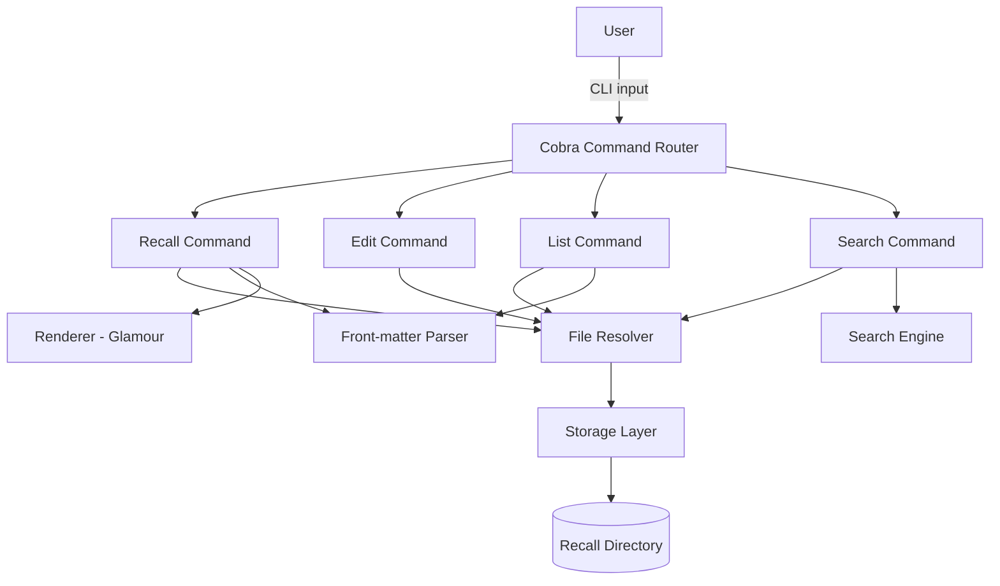

# Design Document: Recall CLI

## Overview

Recall is a Go CLI tool that stores, retrieves, edits, lists, and searches markdown-formatted reference files from the command line. It replaces the deprecated "cheat" application with a modern, cross-platform implementation featuring terminal-aware markdown rendering and tag-based organization.

The application follows a simple architecture: a thin CLI layer dispatches subcommands to domain logic that operates on plain files in a configurable directory. Markdown rendering is delegated to the [Glamour](https://github.com/charmbracelet/glamour) library from Charm Bracelet, and command parsing is handled by [Cobra](https://github.com/spf13/cobra).

### Key Design Decisions

| Decision | Choice | Rationale |
|----------|--------|-----------|
| CLI framework | spf13/cobra | Industry-standard Go CLI library with built-in help generation, flag parsing, and subcommand support |
| Markdown renderer | charmbracelet/glamour | Purpose-built for terminal rendering, stylesheet-driven, handles ANSI escape sequences automatically |
| Storage format | Plain files (no .md extension) | Simplest possible storage; no database overhead; files are human-readable and editable outside the tool |
| Front-matter format | `tags: tag1, tag2` first line | Minimal, easy to parse, doesn't require a YAML parser |
| PBT library | pgregory.net/rapid | Modern Go property-based testing library with automatic shrinking and clean API |

## Architecture



### Package Structure

```
recall/
├── main.go                 # Entry point, calls cmd.Execute()
├── cmd/
│   ├── root.go             # Root command, recall <file> handler
│   ├── edit.go             # Edit subcommand
│   ├── list.go             # List subcommand
│   └── search.go           # Search subcommand
├── internal/
│   ├── config/
│   │   └── config.go       # Directory resolution (RECALL_DIR, $HOME/.recall)
│   ├── frontmatter/
│   │   └── frontmatter.go  # Tag parsing and front-matter stripping
│   ├── renderer/
│   │   └── renderer.go     # Glamour wrapper for markdown rendering
│   ├── search/
│   │   └── search.go       # Case-insensitive search engine
│   └── storage/
│       └── storage.go      # File listing, reading, path construction
├── go.mod
├── go.sum
└── Makefile                # Cross-compilation targets
```

## Components and Interfaces

### 1. Config (`internal/config`)

Resolves the recall directory from environment and platform defaults.

```go
package config

// RecallDir returns the absolute path to the recall directory.
// It checks RECALL_DIR env var first, then falls back to $HOME/.recall.
// Returns an error if the home directory cannot be determined.
func RecallDir() (string, error)

// EnsureDir creates the recall directory (and intermediates) if it doesn't exist.
// Returns an error if the directory cannot be created or is not writable.
func EnsureDir(dir string) error
```

### 2. Front-matter Parser (`internal/frontmatter`)

Parses and strips the `tags:` front-matter line from file content.

```go
package frontmatter

// Parse extracts tags from the first line of content if it matches the
// "tags: tag1, tag2, tag3" format. Returns the parsed tags (trimmed,
// non-empty) and the remaining content with the front-matter line removed.
// If no front-matter is found, returns nil tags and the original content.
func Parse(content []byte) (tags []string, body []byte)

// ParseTagLine parses a single tags line string into a slice of trimmed,
// non-empty tag values. Handles consecutive commas, trailing commas,
// and whitespace around values.
func ParseTagLine(line string) []string
```

### 3. Renderer (`internal/renderer`)

Wraps Glamour to render markdown with terminal-aware formatting.

```go
package renderer

// Render takes markdown content (with front-matter already stripped)
// and returns terminal-formatted output using Glamour.
// Uses the "auto" style which adapts to the terminal's color capabilities.
func Render(content []byte) (string, error)
```

### 4. Search Engine (`internal/search`)

Performs case-insensitive substring search across files.

```go
package search

// Result represents a single search match.
type Result struct {
    Filename string
    LineNum  int    // 1-based
    Line     string // Full content of the matching line
}

// FileResults groups results by file.
type FileResults struct {
    Filename string
    Matches  []Result
}

// Search performs a case-insensitive substring scan of all files in the
// given directory. Returns results grouped by file, with each file's
// matches in ascending line-number order.
func Search(dir string, query string) ([]FileResults, error)

// SearchContent performs a case-insensitive search within a single file's
// content. Returns matches in ascending line-number order.
func SearchContent(filename string, content []byte, query string) []Result
```

### 5. Storage (`internal/storage`)

Handles file system operations: listing, reading, path construction.

```go
package storage

// List returns all regular (non-hidden, non-directory) filenames in
// the recall directory, sorted alphabetically.
func List(dir string) ([]string, error)

// Read returns the content of a recall file by name.
// Returns an error if the file does not exist.
func Read(dir string, name string) ([]byte, error)

// FilePath constructs the full path to a recall file using the OS
// native path separator.
func FilePath(dir string, name string) string

// Exists checks whether a recall file exists.
func Exists(dir string, name string) bool

// Create creates a new empty file in the recall directory.
func Create(dir string, name string) error
```

### 6. CLI Commands (`cmd/`)

Each command is a Cobra command that wires together the internal packages.

```go
// Root command: recall <filename>
// - Resolves the recall directory
// - Reads the file
// - Strips front-matter
// - Renders and prints to stdout

// Edit command: recall edit <filename> / recall -e <filename>
// - Resolves the recall directory
// - Creates file if it doesn't exist
// - Launches $EDITOR with the file path
// - Propagates editor exit code

// List command: recall list [--tag <tag>]
// - Resolves the recall directory
// - Lists files (sorted, no hidden, no dirs)
// - If --tag is provided, filters by tag (case-insensitive)

// Search command: recall search <query>
// - Resolves the recall directory
// - Searches all files case-insensitively
// - Formats and prints results with separators
```

## Data Models

### Recall File Format

A recall file is a plain text file (no `.md` extension) containing optional front-matter followed by markdown content:

```
tags: go, testing, concurrency
# Goroutine Patterns

## Fan-out
Launch multiple goroutines to handle work...
```

### Front-matter Specification

- **Location**: Must be the first line of the file
- **Format**: `tags:` followed by comma-separated values
- **Parsing rules**:
  - Prefix match is case-sensitive: must start with `tags:`
  - Each tag value is trimmed of leading/trailing whitespace
  - Empty values (from consecutive commas or trailing commas) are discarded
  - The front-matter line is excluded from rendered output

### Search Result Format

```
filename:linenum:line_content
```

When multiple files have matches, groups are separated by:
```
----------
```

### Configuration

| Source | Priority | Value |
|--------|----------|-------|
| `RECALL_DIR` env var (non-empty) | 1 (highest) | User-specified path |
| Default | 2 | `$HOME/.recall` |

## Correctness Properties

*A property is a characteristic or behavior that should hold true across all valid executions of a system — essentially, a formal statement about what the system should do. Properties serve as the bridge between human-readable specifications and machine-verifiable correctness guarantees.*

### Property 1: Recall retrieves stored content

*For any* valid filename and markdown content stored in the recall directory, invoking recall with that filename SHALL produce output that contains the rendered body content (excluding front-matter) and exit with zero.

**Validates: Requirements 1.1**

### Property 2: Non-existent file produces silent failure

*For any* filename that does not exist in the recall directory, invoking recall with that filename SHALL produce no output on stdout or stderr and exit with a non-zero code.

**Validates: Requirements 1.2**

### Property 3: Front-matter exclusion

*For any* recall file containing a valid `tags:` front-matter line followed by body content, parsing the file SHALL return the body content unchanged and the tags line SHALL not appear in rendered output.

**Validates: Requirements 1.4, 8.3**

### Property 4: List output is sorted and filtered

*For any* set of files in the recall directory (including hidden files and subdirectories), the list command SHALL return only regular non-hidden filenames in ascending alphabetical order.

**Validates: Requirements 3.1**

### Property 5: Search completeness and soundness

*For any* set of recall files and any search query, the search engine SHALL return exactly the set of lines that contain the query as a case-insensitive substring — no false positives and no false negatives.

**Validates: Requirements 4.1**

### Property 6: Search output format and ordering

*For any* search producing matches, each result line SHALL be formatted as `filename:linenum:content`, lines within a file SHALL appear in ascending line-number order, and results from different files SHALL be separated by `----------`.

**Validates: Requirements 4.2, 4.3, 4.4**

### Property 7: RECALL_DIR configuration is respected

*For any* non-empty value of the RECALL_DIR environment variable, all file operations SHALL occur within that directory path and not the default location.

**Validates: Requirements 5.1**

### Property 8: Auto-creation of recall directory

*For any* valid but non-existent directory path (including nested paths), when configured as the recall directory, the application SHALL create the directory and all intermediate directories before performing file operations.

**Validates: Requirements 5.3**

### Property 9: Path construction uses native separators

*For any* directory and filename combination, the constructed file path SHALL use the operating system's native path separator and SHALL be an absolute path.

**Validates: Requirements 6.2, 6.4**

### Property 10: Unrecognized input produces descriptive error

*For any* string that is not a valid subcommand or flag, invoking recall with that input SHALL produce an error message on stderr that mentions the unrecognized input and exit with a non-zero code.

**Validates: Requirements 7.2**

### Property 11: Tag parsing correctness

*For any* tags line string, parsing SHALL produce a list where every element is a non-empty, trimmed string, and every non-whitespace-only value between commas in the original input appears in the result.

**Validates: Requirements 8.1**

### Property 12: Tag filtering returns exactly matching files

*For any* set of recall files with tags and any filter tag value, the list command with `--tag` SHALL return exactly and only the filenames whose parsed tags contain a case-insensitive match of the filter value.

**Validates: Requirements 8.2**

## Error Handling

| Scenario | Behavior | Exit Code |
|----------|----------|-----------|
| File not found (recall) | No output, silent exit | Non-zero |
| $EDITOR not set (edit) | Error message to stderr | Non-zero |
| Editor exits non-zero | Propagate exit code | Non-zero (from editor) |
| Recall directory unreadable | Error message to stderr | Non-zero |
| Recall directory uncreatable | Error message to stderr | Non-zero |
| Home directory undetermined | Error message to stderr | Non-zero |
| Search without query | Error message to stderr | Non-zero |
| Unrecognized subcommand/flag | Error + usage to stderr | Non-zero |
| Empty list / no search results | No output | Zero |
| List with unmatched --tag | No output | Zero |

### Error Message Style

All error messages are written to stderr and follow the pattern:
```
recall: <description of what went wrong>
```

Cobra handles unrecognized command/flag errors automatically and appends usage information.

## Testing Strategy

### Unit Tests (Example-Based)

Unit tests cover specific scenarios, edge cases, and integration points:

- **Config**: Default path resolution, EDITOR unset error, home dir failure
- **Edit**: File creation for new files, editor subprocess invocation (with mock)
- **Help**: Output contains all subcommands and flags, subcommand-specific help
- **List**: Empty directory returns nothing, unreadable directory errors
- **Search**: No matches returns empty, missing query argument errors
- **Rendering**: Known markdown elements produce ANSI output (integration with Glamour)

### Property-Based Tests (pgregory.net/rapid)

Property-based tests verify universal correctness properties across generated inputs:

- **Library**: `pgregory.net/rapid` — modern Go PBT library with automatic shrinking
- **Minimum iterations**: 100 per property
- **Tag format**: `Feature: recall-cli, Property N: <property text>`

Properties to implement:

1. **Recall retrieves stored content** — generate random filenames/content, verify round-trip
2. **Non-existent file silent failure** — generate random names not in dir
3. **Front-matter exclusion** — generate random tags lines + bodies, verify stripping
4. **List sorted and filtered** — generate random file sets, verify sort/filtering
5. **Search completeness and soundness** — generate files + queries, verify exact matches
6. **Search output format** — verify format pattern and ordering invariants
7. **RECALL_DIR respected** — generate random paths, verify operations use them
8. **Auto-creation** — generate nested paths, verify directory creation
9. **Native path separators** — generate dir/file combos, verify separator correctness
10. **Unrecognized input error** — generate invalid commands, verify error includes input
11. **Tag parsing** — generate tag lines with edge cases, verify trim/no-empty invariants
12. **Tag filtering** — generate files with tags, verify exact filter matches

### Cross-Compilation Smoke Tests

A Makefile or CI script compiles for all target platforms:
- `linux/amd64`, `linux/arm64`
- `darwin/amd64`, `darwin/arm64`
- `windows/amd64`

```makefile
PLATFORMS := linux/amd64 linux/arm64 darwin/amd64 darwin/arm64 windows/amd64

build-all:
	$(foreach platform,$(PLATFORMS),\
		GOOS=$(word 1,$(subst /, ,$(platform))) \
		GOARCH=$(word 2,$(subst /, ,$(platform))) \
		go build -o bin/recall-$(subst /,-,$(platform)) . ;)
```

### Test Execution

```bash
# Run all tests
go test ./...

# Run with verbose property test output
go test -v ./internal/...

# Run only property tests
go test -v -run TestProperty ./...
```
