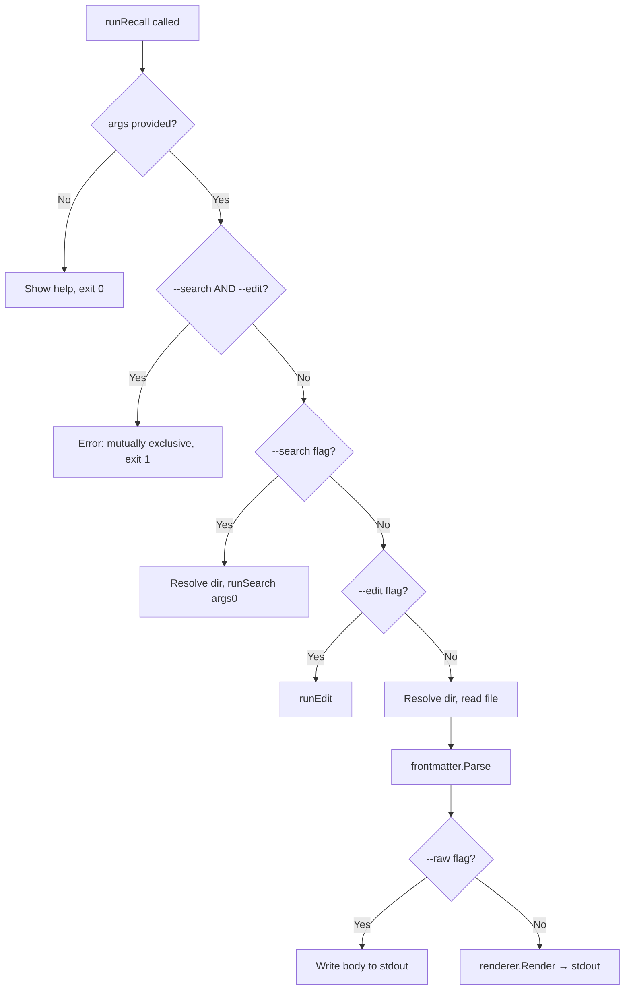

# Design Document

## Overview

This feature adds a `--search` (`-s`) flag to the Recall CLI's root command. When active with a query argument, it performs the same case-insensitive substring search as the existing `search` subcommand and prints identical output. The implementation reuses the existing `internal/search` package and refactors the search-and-print logic out of `searchCmd.RunE` into a shared helper so both entry points behave identically.

The flag is mutually exclusive with `--edit` (`-e`) but compatible with `--raw` (`-r`), which has no effect on search output. It is registered as a local (non-persistent) flag so subcommands do not inherit it.

## Architecture

The existing search flow (subcommand) is:

```
searchCmd.RunE → config.RecallDir() → config.EnsureDir() → search.Search() → print results
```

After the refactor, both the subcommand and the root flag call a shared helper:

```
searchCmd.RunE ─┐
                ├─→ runSearch(dir, query) → search.Search() → print results
runRecall (-s) ─┘
```



Note: the no-argument help branch runs before the search branch, so `recall -s` with no query shows help and exits 0 (Requirement 3.1).

## Components and Interfaces

### Modified: `cmd/search.go`

Extract the search-and-print body from `searchCmd.RunE` into a reusable function so the root flag can call the identical logic:

```go
// runSearch performs a search in dir for query and prints results to stdout
// in the standard "filename:line:content" format, grouping matches by file
// and separating file groups with a "----------" line. Empty results produce
// no output. Directory-resolution and search errors are printed to stderr
// and cause a non-zero exit.
func runSearch(query string) error {
    dir, err := config.RecallDir()
    if err != nil {
        fmt.Fprintln(os.Stderr, err)
        os.Exit(1)
    }
    if err := config.EnsureDir(dir); err != nil {
        fmt.Fprintln(os.Stderr, err)
        os.Exit(1)
    }

    results, err := search.Search(dir, query)
    if err != nil {
        fmt.Fprintf(os.Stderr, "recall: search failed: %v\n", err)
        os.Exit(1)
    }

    for i, fileResult := range results {
        if i > 0 {
            fmt.Fprintf(os.Stdout, "----------\n")
        }
        for _, match := range fileResult.Matches {
            fmt.Fprintf(os.Stdout, "%s:%d:%s\n", match.Filename, match.LineNum, match.Line)
        }
    }
    return nil
}
```

`searchCmd.RunE` retains its no-argument guard (`recall search` with no query prints an error and exits 1 — unchanged behavior) and then calls `runSearch(args[0])`.

### Modified: `cmd/root.go`

**New package-level variable:**

```go
var searchFlag bool
```

**Modified `init()`:**

```go
func init() {
    rootCmd.Flags().BoolVarP(&editFlag, "edit", "e", false, "edit the specified file")
    rootCmd.Flags().BoolVarP(&rawFlag, "raw", "r", false, "output unformatted markdown without ANSI styling")
    rootCmd.Flags().BoolVarP(&searchFlag, "search", "s", false, "search all recall files for the given query")
}
```

**Modified `runRecall()`:** after the no-argument help check and before the existing `rawFlag && editFlag` check, add the search-edit exclusivity check and the search branch:

```go
func runRecall(cmd *cobra.Command, args []string) error {
    if len(args) == 0 {
        return cmd.Help()
    }

    // Search-edit mutual exclusivity
    if searchFlag && editFlag {
        fmt.Fprintln(os.Stderr, "recall: --search and --edit flags cannot be used together")
        os.Exit(1)
    }

    // If -s flag is set, delegate to search logic
    if searchFlag {
        return runSearch(args[0])
    }

    // ... existing --raw/--edit exclusivity check, edit delegation, and display path unchanged
}
```

### Unchanged Components

| Component | Reason |
|-----------|--------|
| `internal/search` | Provides `Search(dir, query)`; used as-is by the shared helper |
| `internal/config` | Directory resolution/creation unchanged |
| `internal/storage` | File listing/reading unchanged |
| `internal/frontmatter`, `internal/renderer` | Unaffected; only used by the display path |
| `cmd/edit.go`, `cmd/list.go`, `cmd/init.go`, `cmd/version.go` | Unaffected; flag is local to root |

## Data Models

No new data models. The feature reuses `search.FileResults` and `search.Result` from `internal/search`.

## Correctness Properties

*A property is a characteristic or behavior that should hold true across all valid executions of a system.*

### Property 1: Flag output equals subcommand output

*For any* Recall_Directory contents and *any* query, the stdout produced by `recall -s <query>` shall be byte-for-byte identical to the stdout produced by `recall search <query>`.

**Validates: Requirements 2.2, 2.3, 2.4**

### Property 2: Search flag never mutates files

*For any* invocation of `recall -s <query>`, the contents of the Recall_Directory shall be unchanged after the command completes.

**Validates: Requirement 2 (search is read-only)**

## Error Handling

| Condition | Behavior | Exit Code |
|-----------|----------|-----------|
| `--search` and `--edit` both set | Print `recall: --search and --edit flags cannot be used together` to stderr, exit | 1 |
| `--search` with no argument | Show help text | 0 |
| `--search` with query, no matches | No output | 0 |
| `--search` with query, matches | Print grouped results | 0 |
| Recall directory unresolvable/uncreatable | Print error to stderr, exit | 1 |
| Search engine returns error | Print `recall: search failed: ...` to stderr, exit | 1 |
| `--search`/`-s` on any subcommand | Cobra prints `unknown flag` / `unknown shorthand flag` to stderr, exit | non-zero |

## Testing Strategy

### Unit / Integration Tests (subprocess-based, in `cmd/root_test.go`)

Following the existing pattern (`buildBinary`, `setupRecallDir`, `runRecall`):

| Test Case | Validates |
|-----------|-----------|
| `--search` flag registered and shown in `--help` | Req 1.1, 1.3 |
| `-s "Hello"` returns matches equal to `search "Hello"` | Req 1.2, 2.1, 2.2, 2.3 |
| `--search "Hello"` returns matches equal to `search "Hello"` | Req 2.2 |
| `-s "zzznomatch"` produces no output, exits 0 | Req 2.4 |
| `-s` with no query shows help, exits 0 | Req 3.1 |
| `-s --edit hello` errors with exclusivity message, exits 1 | Req 4.1 |
| `-s -r "Hello"` accepted, exits 0 | Req 4.2 |
| `--search`/`-s` rejected on edit/list/search/init subcommands | Req 5.1–5.6 |

The equality assertions capture stdout from both `recall search <q>` and `recall -s <q>` runs against the same `setupRecallDir` fixture and compare them directly, satisfying Property 1.
