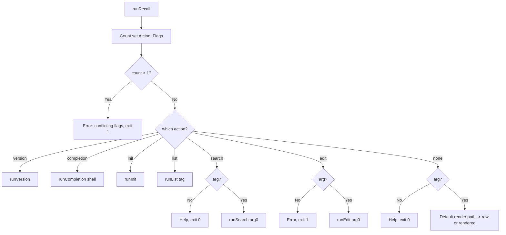

# Design Document

## Overview

Recall currently exposes functionality through Cobra subcommands (`edit`,
`list`, `search`, `init`, `version`, plus Cobra's built-in `completion` and
`help`). Because the root command treats the first positional argument as a
Recall_File to render, subcommand names and filenames share one namespace and
collide. This design removes every subcommand and reimplements each as a
root-level flag, so the first positional argument is unambiguously a filename
(or a query, when `--search` is set).

Two conversions already exist and serve as the template:
- `edit` → `--edit`/`-e` (boolean) delegating to `runEdit`.
- `search` → `--search`/`-s` (boolean) delegating to `runSearch`.

The remaining conversions (`list`, `init`, `version`, `completion`) follow the
same "flag on root → shared helper" pattern.

## Architecture

### Before

```
rootCmd (RunE: runRecall)
├── editCmd     (RunE: runEdit)
├── listCmd     (RunE: inline)
├── searchCmd   (RunE: runSearch wrapper)
├── initCmd     (RunE: inline)
├── versionCmd  (RunE: runVersion)
├── completion  (Cobra built-in)
└── help        (Cobra built-in)

root flags: -e/--edit, -r/--raw, -s/--search
```

### After

```
rootCmd (RunE: runRecall)   ← only command; no AddCommand calls
└── help (Cobra built-in, -h/--help retained)

root flags:
  -e/--edit        (bool)   → runEdit
  -s/--search      (bool)   → runSearch
  -l/--list        (bool)   → runList
  -i/--init        (bool)   → runInit
  -v/--version     (bool)   → runVersion
  -c/--completion  (string) → runCompletion(shell)
  -r/--raw         (bool)   modifies default render path
      --tag        (string) modifies --list
```

### Dispatch flow in `runRecall`



The action dispatch is centralized so mutual exclusivity is enforced once,
replacing the current pairwise `searchFlag && editFlag` / `rawFlag && editFlag`
checks.

## Components and Interfaces

### `cmd/root.go` (primary changes)

Add package-level flag variables and register all flags in `init()`:

```go
var (
    editFlag       bool
    rawFlag        bool
    searchFlag     bool
    listFlag       bool
    initFlag       bool
    versionFlag    bool
    completionFlag string
    tagFlag        string
)

func init() {
    f := rootCmd.Flags()
    f.BoolVarP(&editFlag, "edit", "e", false, "edit the specified file in $EDITOR")
    f.BoolVarP(&searchFlag, "search", "s", false, "search all recall files for the given query")
    f.BoolVarP(&listFlag, "list", "l", false, "list all recall files")
    f.BoolVarP(&initFlag, "init", "i", false, "initialize the recall directory")
    f.BoolVarP(&versionFlag, "version", "v", false, "print the version of recall")
    f.StringVarP(&completionFlag, "completion", "c", "", "generate a completion script for: bash|zsh|fish|powershell")
    f.BoolVarP(&rawFlag, "raw", "r", false, "output unformatted markdown without ANSI styling")
    f.StringVar(&tagFlag, "tag", "", "filter --list by tag (case-insensitive)")
}
```

Disable Cobra's built-in `completion` subcommand and remove all `AddCommand`
calls (which currently live in each subcommand file's `init`):

```go
rootCmd.CompletionOptions.DisableDefaultCmd = true
```

Rewrite `runRecall` to centralize action selection and mutual-exclusivity:

```go
func runRecall(cmd *cobra.Command, args []string) error {
    // Count action flags (completion counts when non-empty)
    actions := 0
    for _, on := range []bool{editFlag, searchFlag, listFlag, initFlag, versionFlag, completionFlag != ""} {
        if on { actions++ }
    }
    if actions > 1 {
        fmt.Fprintln(os.Stderr, "recall: only one action flag (--edit, --search, --list, --init, --version, --completion) may be used at a time")
        os.Exit(1)
    }

    switch {
    case versionFlag:
        return runVersion(cmd, args)
    case completionFlag != "":
        return runCompletion(cmd, completionFlag)
    case initFlag:
        return runInit()
    case listFlag:
        return runList(tagFlag)
    case searchFlag:
        if len(args) == 0 { return cmd.Help() }
        return runSearch(args[0])
    case editFlag:
        if len(args) == 0 {
            fmt.Fprintln(os.Stderr, "recall: --edit requires a filename")
            os.Exit(1)
        }
        return runEdit(cmd, args)
    default:
        if len(args) == 0 { return cmd.Help() }
        return renderFile(args[0]) // existing default path, extracted
    }
}
```

Remove `reservedNames` and `IsReservedName`; the namespace collision they
guarded against no longer exists.

### `cmd/edit.go`

- Remove `editCmd` and its `init()` `AddCommand`.
- Keep `runEdit(cmd, args)` as-is, except delete the `IsReservedName` check.

### `cmd/search.go`

- Remove `searchCmd` and its `init()` `AddCommand`.
- Keep `runSearch(query)` unchanged.

### `cmd/list.go`

- Remove `listCmd` and its `init()` `AddCommand`.
- Extract the body into `runList(tag string) error` (moves `tagFlag` usage to
  the passed parameter; the flag itself is declared in `root.go`).

### `cmd/init.go`

- Remove `initCmd` and its `init()` `AddCommand`.
- Extract into `runInit(path string) error`. When `path` is empty, resolve the
  default/`RECALL_DIR` directory; otherwise use `path`. Call `config.EnsureDir`
  and print the confirmation.
- Replace the optional positional `[path]` with the `--init-path <dir>` root
  flag (Requirement 5.3).

### `cmd/version.go`

- Remove `versionCmd` and its `init()` `AddCommand`.
- Keep `runVersion(cmd, args)` unchanged.

### `cmd/completion.go` (new)

Implement `runCompletion` using Cobra's generators against `rootCmd`:

```go
func runCompletion(cmd *cobra.Command, shell string) error {
    switch strings.ToLower(shell) {
    case "bash":
        return cmd.Root().GenBashCompletionV2(os.Stdout, true)
    case "zsh":
        return cmd.Root().GenZshCompletion(os.Stdout)
    case "fish":
        return cmd.Root().GenFishCompletion(os.Stdout, true)
    case "powershell":
        return cmd.Root().GenPowerShellCompletionWithDesc(os.Stdout)
    default:
        fmt.Fprintf(os.Stderr, "recall: unsupported shell %q (supported: bash, zsh, fish, powershell)\n", shell)
        os.Exit(1)
        return nil
    }
}
```

## Conflict Resolution Decisions

| Item | Conflict | Resolution |
|------|----------|------------|
| First-letter switches | `c,e,i,l,s,v` — none collide with each other or `-h` | Use them directly (Req 8.1) |
| `completion` argument | Boolean flag can't carry shell name | Make `--completion`/`-c` a **string** flag taking the shell (Req 7) |
| `init [path]` optional arg | Positional path vs. filename ambiguity | Replace positional with `--init-path <dir>` flag (Req 5.3) |
| `list --tag` sub-flag | `--tag` belonged to the subcommand | Promote `--tag` to a root flag used only with `--list` (Req 4.3) |
| Multiple action flags | Old pairwise checks don't scale to 6 flags | Single "at most one action flag" check (Req 9.1) |
| `reservedNames` | No longer needed once subcommands gone | Remove `IsReservedName` and its call site (Req 1.8) |
| `-r/--raw` combined with an action | `--raw` only affects default render | Ignore `--raw` for non-render actions (Req 9.2) |

## Data Models

No new data models. Existing `internal/*` packages (`config`, `storage`,
`search`, `frontmatter`, `renderer`, `buildinfo`) are reused unchanged.

## Correctness Properties

### Property 1: Any name is a valid filename
*For any* string `<name>` (including former subcommand names), `recall <name>`
follows Default_Recall_Behavior and never routes to a removed subcommand.
**Validates: Req 1.7, 1.8**

### Property 2: Flag output parity with former subcommands
*For any* Recall_Directory contents, `recall --search q`, `recall --list`,
`recall --version`, and `recall --init` produce output equivalent to the
former `search q`, `list`, `version`, and `init` subcommands respectively.
**Validates: Req 3.2, 4.2, 5.2, 6.2**

### Property 3: At most one action
*For any* invocation with two or more Action_Flags set, the command exits 1
with a conflict message and performs no action.
**Validates: Req 9.1**

## Error Handling

| Condition | Behavior | Exit |
|-----------|----------|------|
| >1 action flag | conflict error to stderr | 1 |
| `--edit` no arg | error to stderr | 1 |
| `--search` no arg | help | 0 |
| `--completion` bad/empty shell | error listing shells | 1 |
| `$EDITOR` unset with `--edit` | error to stderr | 1 |
| directory unresolvable (init/list/search) | error to stderr | 1 |
| no flags, no arg | help | 0 |

## Testing Strategy

Subprocess integration tests in `cmd/root_test.go` using existing helpers
(`buildBinary`, `buildBinaryWithMetadata`, `setupRecallDir`, `runRecall`):

| Test | Validates |
|------|-----------|
| `--help` lists flags, no subcommands | Req 10.1 |
| `recall list` (as filename) → render/not-found, not subcommand | Req 1.7 |
| `--edit hello` opens editor path (stubbed `$EDITOR`) | Req 2.2 |
| `--edit` no arg → error, exit 1 | Req 2.3 |
| `--search Hello` == former search output | Req 3.2 |
| `--search` no arg → help, exit 0 | Req 3.3 |
| `--list` lists files; `--list --tag greeting` filters | Req 4.2, 4.3 |
| `--init` creates dir + confirmation | Req 5.2 |
| `--version` prints metadata (metadata build) | Req 6.2 |
| `--completion bash|zsh|fish|powershell` emits script, exit 0 | Req 7.3 |
| `--completion bogus` → error, exit 1 | Req 7.4 |
| `--edit --list` (two actions) → conflict, exit 1 | Req 9.1 |
| short forms `-e -s -l -i -v -c` behave as long forms | Req 8.1 |

Remove or update existing subcommand-oriented tests that assert subcommand
presence or reserved-name rejection.
