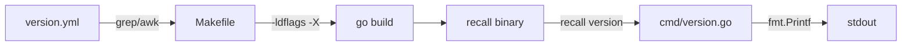

# Design Document

## Overview

This design adds a `version` subcommand to the Recall CLI that prints the application's semantic version string and exits. The version values are maintained in a `version.yml` file at the project root and injected into the binary at compile time using Go linker flags (`-ldflags -X`). The feature also registers "version" as a reserved name to prevent filename collisions.

The design is intentionally minimal — a single new file (`cmd/version.go`), a YAML version source (`version.yml`), and Makefile updates. No new dependencies are needed; the existing `cobra` framework and standard library handle everything.

## Architecture



**Build-time flow:**
1. `version.yml` stores the canonical version as three integer fields.
2. The Makefile extracts values using shell commands (grep + awk or yq).
3. Values are passed to `go build` via `-ldflags` targeting package-level variables in `cmd`.

**Run-time flow:**
1. User invokes `recall version`.
2. Cobra routes to the version subcommand.
3. The `RunE` function reads the package-level variables and prints the formatted string.
4. The command exits with code 0. No config, directory, or file I/O is needed.

## Components and Interfaces

### 1. `version.yml` (Project Root)

A plain YAML file with three integer fields:

```yaml
major: 0
minor: 1
patch: 0
```

### 2. `cmd/version.go`

A new file in the `cmd` package declaring:

```go
package cmd

import (
    "fmt"

    "github.com/spf13/cobra"
)

// Package-level variables set via -ldflags at build time.
var (
    Version string // Composite version string (optional, for future use)
    Major   string
    Minor   string
    Patch   string
)

var versionCmd = &cobra.Command{
    Use:   "version",
    Short: "Print the version of recall",
    Long:  "Print the version of the recall binary and exit.",
    Args:  cobra.NoArgs,
    RunE:  runVersion,
}

func init() {
    rootCmd.AddCommand(versionCmd)
}

func runVersion(cmd *cobra.Command, args []string) error {
    fmt.Printf("recall version %s\n", formatVersion(Major, Minor, Patch))
    return nil
}

// formatVersion constructs the semantic version string from components.
// If any component is empty (ldflags not provided), returns "unknown".
func formatVersion(major, minor, patch string) string {
    if major == "" || minor == "" || patch == "" {
        return "unknown"
    }
    return major + "." + minor + "." + patch
}
```

**Design decisions:**
- `formatVersion` is a pure function extracted for testability.
- When ldflags are not provided, variables remain empty strings (Go default). The function returns `"unknown"` rather than an empty or malformed string.
- `cobra.NoArgs` rejects extraneous arguments.
- The `Version` variable is declared for potential future use (e.g., pre-release suffixes) but not actively used in the format logic.

### 3. `cmd/root.go` (Modification)

Add `"version": true` to the `reservedNames` map:

```go
var reservedNames = map[string]bool{
    "edit":    true,
    "list":    true,
    "search":  true,
    "init":    true,
    "version": true,
}
```

### 4. Makefile (Modification)

Add version extraction variables and update build targets:

```makefile
# Version extraction from version.yml
VERSION_MAJOR := $(shell grep '^major:' version.yml | awk '{print $$2}')
VERSION_MINOR := $(shell grep '^minor:' version.yml | awk '{print $$2}')
VERSION_PATCH := $(shell grep '^patch:' version.yml | awk '{print $$2}')
LDFLAGS := -ldflags "-X $(MODULE)/cmd.Major=$(VERSION_MAJOR) -X $(MODULE)/cmd.Minor=$(VERSION_MINOR) -X $(MODULE)/cmd.Patch=$(VERSION_PATCH)"

.PHONY: build
build:
	@mkdir -p $(BUILD_DIR)
	CGO_ENABLED=0 go build $(LDFLAGS) -o $(BUILD_DIR)/$(BINARY_NAME) .

.PHONY: build-all
build-all:
	@mkdir -p $(BUILD_DIR)
	@$(foreach platform,$(PLATFORMS),\
		$(eval OS := $(word 1,$(subst /, ,$(platform))))\
		$(eval ARCH := $(word 2,$(subst /, ,$(platform))))\
		$(eval EXT := $(if $(filter windows,$(OS)),.exe,))\
		echo "Building $(BINARY_NAME)-$(OS)-$(ARCH)$(EXT)..." && \
		CGO_ENABLED=0 GOOS=$(OS) GOARCH=$(ARCH) go build $(LDFLAGS) -o $(BUILD_DIR)/$(BINARY_NAME)-$(OS)-$(ARCH)$(EXT) . && \
	) true
```

## Data Models

### Version File Schema (`version.yml`)

| Field   | Type    | Description                    | Constraints     |
|---------|---------|--------------------------------|-----------------|
| `major` | integer | Major version number           | >= 0            |
| `minor` | integer | Minor version number           | >= 0            |
| `patch` | integer | Patch version number           | >= 0            |

### Package-Level Variables (`cmd/version.go`)

| Variable  | Type   | Set By       | Default | Purpose                              |
|-----------|--------|--------------|---------|--------------------------------------|
| `Version` | string | ldflags (future) | `""`    | Composite version (reserved for future) |
| `Major`   | string | ldflags      | `""`    | Major version component              |
| `Minor`   | string | ldflags      | `""`    | Minor version component              |
| `Patch`   | string | ldflags      | `""`    | Patch version component              |

Note: Values are strings because `-ldflags -X` can only set string variables. The Makefile reads integers from YAML and passes them as string values.

## Correctness Properties

*A property is a characteristic or behavior that should hold true across all valid executions of a system — essentially, a formal statement about what the system should do. Properties serve as the bridge between human-readable specifications and machine-verifiable correctness guarantees.*

### Property 1: Version format correctness

*For any* three non-empty strings representing major, minor, and patch values, `formatVersion(major, minor, patch)` SHALL return the string `major + "." + minor + "." + patch`, and the full command output SHALL be exactly `"recall version " + major + "." + minor + "." + patch + "\n"` (one line, no extra whitespace or newlines).

**Validates: Requirements 1.1, 1.3, 4.3**

### Property 2: Empty components produce "unknown"

*For any* combination of major, minor, and patch where at least one component is an empty string, `formatVersion(major, minor, patch)` SHALL return `"unknown"`.

**Validates: Requirements 4.2**

## Error Handling

| Scenario                         | Behavior                                              |
|----------------------------------|-------------------------------------------------------|
| ldflags not provided             | Output: `recall version unknown`, exit code 0         |
| Extra arguments to `recall version` | Cobra rejects with usage error (NoArgs constraint)  |
| "version" used as filename       | Existing reserved-name logic rejects with error message |
| version.yml missing at build time | Makefile `grep` returns empty → ldflags set empty strings → runtime shows "unknown" |

The version command has no failure paths of its own — it reads in-memory variables and writes to stdout. All error conditions are handled at build time (Makefile) or by Cobra's argument validation.

## Testing Strategy

### Unit Tests (Example-Based)

| Test Case                                  | Validates       |
|--------------------------------------------|-----------------|
| `formatVersion("0", "1", "0")` returns `"0.1.0"` | Req 1.1    |
| `formatVersion("", "1", "0")` returns `"unknown"` | Req 4.2    |
| `formatVersion("", "", "")` returns `"unknown"`   | Req 4.2    |
| `IsReservedName("version")` returns `true`         | Req 5.1    |
| Version command exits 0                            | Req 1.2    |
| Version command produces one line                  | Req 1.3    |
| Version command works without recall directory     | Req 6.1    |

### Property-Based Tests

Property-based testing is appropriate for this feature because `formatVersion` is a pure function with clear input/output behavior and a large input space (arbitrary string triples).

**Library:** `pgregory.net/rapid` (already a project dependency)

**Configuration:**
- Minimum 100 iterations per property test
- Tag format: `Feature: version-command, Property N: <property text>`

| Property Test                              | Validates       | Iterations |
|--------------------------------------------|-----------------|------------|
| Format correctness (random non-empty strings) | Req 1.1, 1.3, 4.3 | 100+   |
| Empty component detection (random strings with at least one empty) | Req 4.2 | 100+ |

### Integration Tests

| Test Case                                          | Validates       |
|----------------------------------------------------|-----------------|
| `make build` produces binary with correct version  | Req 3.1, 3.2   |
| Built binary outputs expected format               | Req 3.1, 3.2   |

### Smoke Tests

| Test Case                                | Validates |
|------------------------------------------|-----------|
| `version.yml` exists at project root     | Req 2.3   |
| Code compiles (variables declared)       | Req 4.1   |
