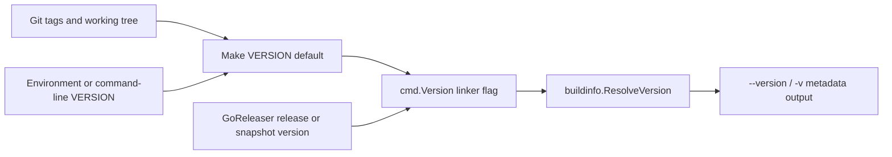

# Design: Version Metadata

## Data flow

```mermaid
flowchart LR
    Git[Git tags and working tree] --> Make[Make VERSION default]
    Override[Environment or command-line VERSION] --> Make
    Make --> Inject[cmd.Version linker flag]
    GoReleaser[GoReleaser release or snapshot version] --> Inject
    Inject --> Normalize[buildinfo.ResolveVersion]
    Normalize --> Output[--version / -v metadata output]
```

The Make default is `git describe --tags --dirty=-local` with matching patterns
`v[0-9]*`, `V[0-9]*`, and `[0-9]*`, falling back to `unknown` on failure.
Git selects the nearest reachable matching tag. Untracked files do not affect
the local suffix. Explicit overrides bypass this command.

`ResolveVersion(version string) string` trims surrounding whitespace and one
leading v/V and returns `unknown` if the result is empty. It preserves commit
identifiers, local markers, prerelease suffixes, and build metadata.

`Collect(version, gitBranch, buildEnv, buildDate string) Metadata` combines the
normalized version with embedded Go build information and existing linker flag
fallbacks. Version lookup never requires Git at runtime.

The regular CI build fetches all history and tags. Release snapshot and publish
jobs check out the same requested tag; snapshot artifacts carry snapshot version
metadata and published artifacts carry release version metadata. GoReleaser
continues to build the five supported platforms. There is no post-release
version synchronization job.

The Make override affects direct Go builds only; snapshot and install targets
use GoReleaser's version. Plain Go builds display `unknown`.
